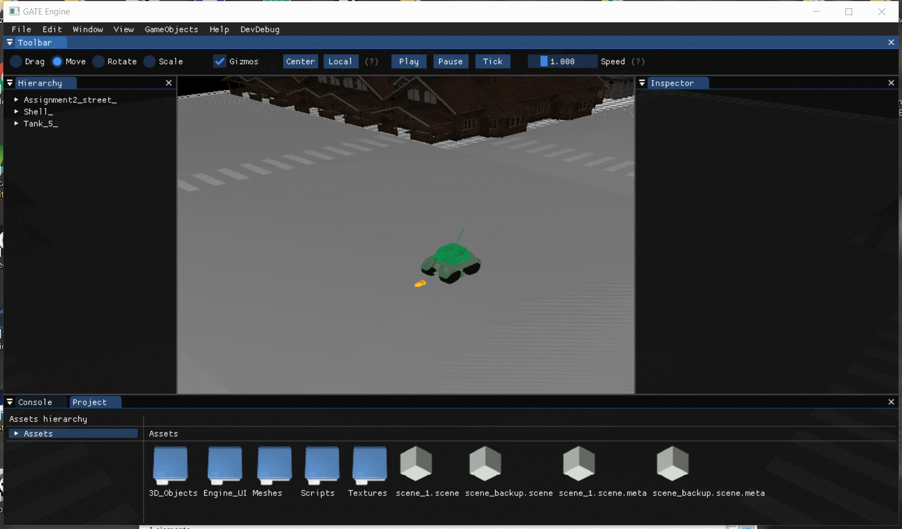

# GATE by Doc Donkeys
This is a university project made by [CITM](https://www.citm.upc.edu/ing/) Centre de la Imatge i la Tecnologia Multimedia students of the TTC (Talent Tech Center) in Barcelona, in which we made a 3D Game Engine in C & C++ during our 3rd year of Game Development Bachelor's Degree.

[Repository](https://github.com/DocDonkeys/GATE_Engine)

[Releases](https://github.com/DocDonkeys/GATE_Engine/releases)

[Last release direct download](https://github.com/DocDonkeys/GATE_Engine/releases/download/Assignment3.1/GATE_Engine.zip)

[Last Release](https://github.com/DocDonkeys/GATE_Engine/releases/tag/Assignment3.1)

## The Team: [Doc Donkeys](https://github.com/DocDonkeys)
* Carles Homs 
  * Role: Code
  * Github: [ch0m5](https://github.com/ch0m5)

* Dídac Romero
  * Role: Code
  * Github: [DídacRomero](https://github.com/DidacRomero)


Carles Homs (left) & Dídac Romero (right).

## Tasks completed

#### Carles Homs

* Images Loading
* Profiling with Brofiler
* Engine UI display & structuring
* Transformations
* Space Partitioning (quadtree octree) & static objects partition accordingly
* Camera & Culling
* Mouse Picking
* Play mode (Time Management)
* Gizmos
* Demo Scripts (Tank movement & shooting and others)
* Engine Functions callable from LUA Scripts
* Script files variables parsing & display


#### Dídac Romero

* 3D Models loading 
* GameObject & Components
* Hierarchy
* Own File Format
* Serialization
* Resource Manager
* Scripting Class alike based Structure & functionalities
* Script files variables parsing & display
* Scripting Hot Reloading

## Core Subsystems

### GameObjects

GameObjects are entities structured after the (ECS)Entity Component Structure, they can have the following components:
* Transform

Represents, changes & allows to edit a gameobject position, rotation and scaling.

* Mesh

A 3D mesh that can be printed out to screen.

* Material

An image that can be applied to a mesh, using its UV channel to properly apply to the mesh.

* Camera

A camera that can have its values customized and used to display the scene.

* Script

Allows to change values of a gameobject in play time depending on conditions, functions and values inside a Lua script.
### Resource Manager
 The Resource Manager is in charge of managing the GameObjects and components resources, such as the images, the 3D models, the scripts etc.
 If we had the same house 2 times in the scene for instance, the resource Manager will make sure that we don't load resources 2 times.
 It also allows us to create custom files to represent resources such as 3D Models in the way we manage them in the engine, making it lightning fast at  the time of loading a scene or a file.
 
 When a user drops a file to the engine, the resource manager will create the appropiate .meta files with information and the own format files that we need. When dragging an object alreaduy processed by the engine, we will load the own format files to load the asset faster.
 
### UI

The UI was done using ImGui and provides an editor to use and tweak all the facilities of the engine (from an engine user perspective).
The module that manages the UI does so in a way that makes it incredibly easy to create new windows and elements in diferent files to keep code clean and readable.

## Scripting subsystem

The engine features a module that allows scripting in Lua, to code in smalls scripts all the gameplay code.

* Drag a script from the project window into a GameObject to attach a script component with the script.
  Double click on a script to automatically open it with your prefered Code Editor for .lua files, so that you can use all the intellisense features and alike of your favorite IDE. If you have none defined, windows will ask you to define one. 
  
For Visual Studio, remember that you must set devenv.exe as the favorite editor if this window from windows pops-up. If you are using Visual Studio with Lua for the first time, we recommend you install [this plugin for visual studio](https://marketplace.visualstudio.com/items?itemName=Xizhi.NPLLuaLanguageService) or any plugin that suits your needs of coloring, autocompletion, intellisense and such. 
  
* When scripting you code a table as if it were a class that will be instantiated for each component, with its values independent from one another, allowing you to have various instances of the same script running in diferent components and with diferent values. Basically, the table is encapsulated inside a function that returns the table and we load them inside ScriptInstances in the engine.

To create a script that will run in the engine first create a function with the name GetTable + the name of the script, if it's not exactly GetTable followed by the name of the script the script won't load. For example, for a file Move.lua, the function would be GetTableMove. inside the function create a local table, add all the values you want, and remember to return the local table at the end of the function. Code example:
``` 
function GetTableMove ()
local lua_table = {}

--Functions and variables here, you can look at any demo script used by the tank to get an idea on how to do this

return lua_table
end
```

* Script Instances contain the class that is in its script, already compiled and loaded by the Lua Virtual Machine, and inside the engine we use it to call functions of the script from C++ and to obtain variable values to display them in the editor and change them from the engine editor itself.

* If you define the functions Awake(), Start() and Update(), they will be called by the engine with the order and consistency of other game engines.

* You can call a set of defined functions of the engine from the script in order to do things like moving a gameobject instantiating a gameobject etc.

* The scripting system features Hot Reloading, meaning that files can be edited while the engine is open, and the changes made to the scripts will be recompiled and applied while the engine is running, although if you edit a script while playing, the Hot Reloading will be done after you stop playing.

* The Engine sill notify you in the console if the scripts did or did not compile.

* In the script component of a file you can see the variables of a table and you can edit them from the editor itself

Tank Gameplay demonstration.


Hot reloading and editor demonstration.


## Showcase
### Full Showcase
<iframe width="768" height="432" src="https://www.youtube.com/embed/RLeXGrHI3Ww" frameborder="0" allow="accelerometer; autoplay; encrypted-media; gyroscope; picture-in-picture" allowfullscreen></iframe>

### Quick Showcase
<iframe width="768" height="432" src="https://www.youtube.com/embed/-h25pq0d9Vs" frameborder="0" allow="accelerometer; autoplay; encrypted-media; gyroscope; picture-in-picture" allowfullscreen></iframe>

## Libraries Used
* [STL (C++11)](https://www.geeksforgeeks.org/the-c-standard-template-library-stl/)
* [SDL (v2.0.10)](https://www.libsdl.org/)
* [OpenGL (v3.1.0)](https://www.opengl.org/)
* [DevIL (v1.8.0)](http://openil.sourceforge.net/)
* [Assimp (v5.0.0)](http://assimp.org/)
* [Dear ImGui v1.73, Docking Test Branch](https://github.com/ocornut/imgui)
* [glew (v2.0)](http://glew.sourceforge.net/)
* [MathGeoLib (v1.5)](https://github.com/juj/MathGeoLib)
* [Par (vN/A)](https://github.com/prideout/par)
* [JSON for Modern C++ (v3.7.0)](https://github.com/nlohmann/json)
* [Brofiler (v1.1.2)](http://www.brofiler.com/)
* [mmgr (vN/A)](http://www.flipcode.com/archives/Presenting_A_Memory_Manager.shtml)

## Installation
No previous installations is required to use the engine, just download and execute the .exe file *GATE_Engine* from releases.

## Camera Controls
### Mouse
* MiddleButtonClickDrag: Move the camera in the plane of the camera frame.
* MouseWheel: Move camera forwards of backwards.
* LeftClickDrag: Move the camera in the plane of the camera frame.
* RightClickDrag: Rotate on itself.
* Left Alt + LeftClickDrag: Rotate around reference point.
* Left Alt + RightClickDrag: Move camera forwards of backwards.

### Keyboard
* RightMouseClick + W/S, A/D, Q/E: Move camera forwards, backwards, sideways, and vertically.
* Movement + MouseWheel: Increase or decrease camera speed.
* Up/Down, Left/Right Arrows: Move camera forwards, backwards, and sideways.
* Shift + Movement: Boost camera speed (multiplier).
* Double Tap Movement Key: Boost camera speed (multiplier).
* Keypad 8/2/4/6, 7/1: Rotate camera on itself and move it vertically.

## Contributing
1. Fork it!
2. Create your feature branch: `git checkout -b my-newfeature`
3. Commit your changes: `git commit -am 'Add some
feature'`
4. Push to the branch: `git push origin my-new-feature`
5. Submit a pull request and we might look into it. :D


## License & Copyright 

[MIT License](https://github.com/DocDonkeys/GATE/blob/master/LICENSE)

Copyright (c) 2019 DocDonkeys

Permission is hereby granted, free of charge, to any person obtaining a copy
of this software and associated documentation files (the "Software"), to deal
in the Software without restriction, including without limitation the rights
to use, copy, modify, merge, publish, distribute, sublicense, and/or sell
copies of the Software, and to permit persons to whom the Software is
furnished to do so, subject to the following conditions:

The above copyright notice and this permission notice shall be included in all
copies or substantial portions of the Software.

THE SOFTWARE IS PROVIDED "AS IS", WITHOUT WARRANTY OF ANY KIND, EXPRESS OR
IMPLIED, INCLUDING BUT NOT LIMITED TO THE WARRANTIES OF MERCHANTABILITY,
FITNESS FOR A PARTICULAR PURPOSE AND NONINFRINGEMENT. IN NO EVENT SHALL THE
AUTHORS OR COPYRIGHT HOLDERS BE LIABLE FOR ANY CLAIM, DAMAGES OR OTHER
LIABILITY, WHETHER IN AN ACTION OF CONTRACT, TORT OR OTHERWISE, ARISING FROM,
OUT OF OR IN CONNECTION WITH THE SOFTWARE OR THE USE OR OTHER DEALINGS IN THE
SOFTWARE.
